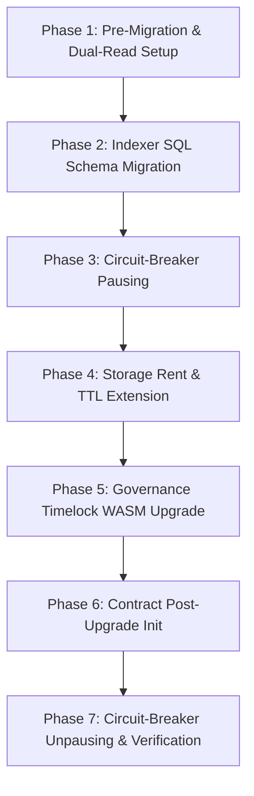

# Stellar Contracts Migration Guide: v0 to v1

This document is the authoritative end-to-end migration guide and technical reference for upgrading Wraith Protocol smart contracts on Stellar from the initial v0 cut to the v1 release. 

It provides maintainers, indexer operators, SDK developers, and partner protocols with:
- A field-by-field storage layout diff across all contracts.
- An event-topic layout diff and RPC parsing specification.
- A zero-downtime, step-by-step upgrade checklist.
- A documented Futurenet rehearsal run with verifiable transaction references.
- Reference SQL schema migration scripts for off-chain indexers.

---

## 1. Governance & Upgradability Matrix

Wraith Protocol contract architecture separates immutable core components (frozen) from configurable logic (timelocked and pausable) to balance trust-minimization with emergency incident response.

| Contract Crate | Governance Model | Upgrade Authority | Circuit-Breaker (Pausable) | Storage Persistence Model |
|---|---|---|---|---|
| `stealth-announcer` | **Frozen (Immutable)** | None | No | Stateless (Events Only) |
| `stealth-registry` | **Frozen (Immutable)** | None | No | `persistent()` with TTL auto-extension |
| `stealth-sender` | **Timelocked + Multisig** | 3-of-5 Multisig | **Yes** (`DataKey::Paused`) | `instance()` for config; token transfers |
| `stealth-batch-sender` | **Timelocked + Multisig** | 3-of-5 Multisig | **Yes** (`DataKey::Paused`) | `instance()` for config |
| `stealth-splitter` | **Timelocked + Multisig** | 3-of-5 Multisig | **Yes** (`DataKey::Paused`) | `persistent()` for split definitions |
| `stealth-vault` | **Timelocked + Multisig** | 3-of-5 Multisig | **Yes** (`DataKey::Paused`) | `persistent()` for time-locked deposits |
| `wraith-names` | **Timelocked + Multisig** | 3-of-5 Multisig | **Yes** (`DataKey::Paused`) | `persistent()` for name & reverse records |
| `wraith-asset-policy` | **Admin Managed** | Admin Address | No | `instance()` admin, `persistent()` allowlist |
| `wraith-metrics` | **Library Module** | N/A | N/A | Stateless (Metric Event Publishing) |

---

## 2. Field-by-Field Storage Diff (v0 vs v1)

Cutting v1 contracts expands contract state to support persistent rent isolation, circuit-breaker pause states, 7-day governance timelocks, hierarchical subdomains, multisig recovery, and optional asset allowlists/protocol fee configurations.

### 2.1 `stealth-announcer`
- **v0 Layout:** Stateless contract. Emitted announcements with topic 2 set to `stealth_address`.
- **v1/v2 Layout:** Stateless contract. Emits announcements with topic 2 set to `view_tag_bucket` and topic 3 set to `metadata_kind`.
- **Diff:** No storage keys added (contract is stateless).

---

### 2.2 `stealth-registry`
- **v0 Storage Layout:**
  - Storage Type: `instance()` or `temporary()` mapping keys.
  - DataKey: `DataKey::MetaAddress(Address, u32)` -> `Bytes` (64 bytes: `spending_pubkey || viewing_pubkey`).
- **v1 Storage Layout:**
  - Storage Type: **`persistent()`** (`env.storage().persistent()`).
  - DataKey: `DataKey::MetaAddress(Address, u32)` -> `Bytes` (64 bytes).
  - TTL Rules: `TTL_THRESHOLD = 17,280` ledgers (~1 day), `TTL_EXTEND_TO = 518,400` ledgers (~30 days).
- **Diff Details:**
  | Field / DataKey | v0 Location / Type | v1 Location / Type | Purpose / Rationale |
  |---|---|---|---|
  | `DataKey::MetaAddress` | `instance()` / `temporary()` | `persistent()` | Moves meta-address registrations into independent ledger entries, allowing infinite user scaling without hitting single-entry instance size caps. |

---

### 2.3 `stealth-sender`
- **v0 Storage Layout:**
  - Storage Type: `instance()`
  - DataKey: `DataKey::Announcer` -> `Address`
- **v1 Storage Layout:**
  - Storage Type: `instance()`
  - DataKey: `DataKey::Announcer` -> `Address`
  - Added DataKeys:
    - `DataKey::AssetPolicy` -> `Option<Address>` (Asset allowlist policy contract)
    - `DataKey::FeeRecipient` -> `Option<Address>` (Protocol fee collector address)
    - `DataKey::FeeBasisPoints` -> `u32` (Protocol fee bps, max 50 bps = 0.5%)
    - `DataKey::Paused` -> `bool` (Pausable circuit breaker state)
    - `DataKey::Admin` -> `Address` (Pause & governance timelock authority)
    - `DataKey::UpgradeProposed` -> `BytesN<32>` (Proposed WASM bytecode hash)
    - `DataKey::TimelockEnd` -> `u32` (Ledger sequence when proposed upgrade becomes executable)
- **Diff Details:**
  | DataKey Variant | Storage Type | Data Type | Default / Constraints | Rationale |
  |---|---|---|---|---|
  | `Announcer` | `instance()` | `Address` | Set at `init` | Address of deployed `stealth-announcer` |
  | `AssetPolicy` | `instance()` | `Address` | Optional | Address of asset allowlist contract |
  | `FeeRecipient` | `instance()` | `Address` | Optional | Recipient address for protocol fee |
  | `FeeBasisPoints` | `instance()` | `u32` | Max 50 bps (0.5%) | Protocol fee percentage |
  | `Paused` | `instance()` | `bool` | `false` | Emergency circuit-breaker switch |
  | `Admin` | `instance()` | `Address` | Multisig | Admin authority for pause and upgrades |
  | `UpgradeProposed` | `instance()` | `BytesN<32>` | None | Pending upgrade WASM hash |
  | `TimelockEnd` | `instance()` | `u32` | Proposal + 120,960 ledgers | 7-day timelock delay (~604,800s) |

---

### 2.4 `wraith-names`
- **v0 Storage Layout:**
  - Storage Type: `temporary()` / `instance()`
  - DataKeys:
    - `DataKey::Name(BytesN<32>)` -> `NameEntry { name: String, stealth_meta_address: Bytes, owner: Address }`
    - `DataKey::Reverse(BytesN<32>)` -> `BytesN<32>` (name hash)
- **v1 Storage Layout:**
  - Storage Type: **`persistent()`** for name and reverse records.
  - DataKeys & Struct Updates:
    - `DataKey::Name(BytesN<32>)` -> `NameEntry` (Updated struct):
      - `name`: `String`
      - `stealth_meta_address`: `Bytes` (64 bytes)
      - `owner`: `Address`
      - `parent`: `Option<BytesN<32>>` *(NEW: Hierarchical subdomains, `None` for root names)*
    - `DataKey::Reverse(BytesN<32>)` -> `BytesN<32>`
    - `DataKey::Replay(BytesN<32>)` -> `bool` *(NEW: Replay protection for gasless `on-behalf` transactions)*
    - `DataKey::Guardians(BytesN<32>)` -> `GuardianConfig { guardians: Vec<Address>, threshold: u32 }` *(NEW: Multisig social recovery configuration)*
    - `DataKey::Recovery(BytesN<32>)` -> `RecoveryProposal { new_owner: Address, new_meta_address: Bytes, proposed_at: u32, approvals: Vec<Address> }` *(NEW: Active recovery proposal)*
    - `DataKey::Paused` -> `bool` *(NEW: Pausable circuit breaker state)*
    - `DataKey::Admin` -> `Address` *(NEW: Timelock & pause authority)*
- **Diff Details:**
  | Field / DataKey | v0 Type | v1 Type | Purpose |
  |---|---|---|---|
  | `NameEntry.parent` | N/A | `Option<BytesN<32>>` | Identifies parent label hash for subdomain ownership enforcement (`sub.domain.wraith`) |
  | `DataKey::Replay` | N/A | `BytesN<32>` | Prevents replay attacks on off-chain signed name registrations |
  | `DataKey::Guardians` | N/A | `GuardianConfig` | Configures M-of-N guardians for social recovery |
  | `DataKey::Recovery` | N/A | `RecoveryProposal` | Tracks pending ownership recovery proposals |
  | `DataKey::Paused` | N/A | `bool` | Allows admin to freeze name mutations during incidents |

---

### 2.5 `stealth-vault`
- **v0 Storage Layout:** N/A (New in v1).
- **v1 Storage Layout:**
  - Storage Type: `instance()` for `Announcer` address, admin, and pause state;
    `persistent()` for deposit records.
  - DataKeys:
    - `DataKey::Announcer` -> `Address`
    - `DataKey::Admin` -> `Address` (pause admin; set at `init`)
    - `DataKey::Paused` -> `bool` (blocks new deposits; exits stay callable)
    - `DataKey::GracePeriod` -> `u32` (ledgers; defaults to 1000, admin-retunable)
    - `DataKey::Deposit(BytesN<32>)` -> `DepositEntry`:
      - `sender`: `Address`
      - `recipient`: `Address`
      - `amount`: `i128`
      - `asset`: `Address`
      - `unlock_ledger`: `u32` (Ledger sequence before which funds cannot be withdrawn)
      - `refund_after`: `u32` (Ledger sequence after which sender can claim refund)

---

### 2.6 `stealth-splitter`
- **v0 Storage Layout:** `instance()` basic splitter config.
- **v1 Storage Layout:**
  - Storage Type: `instance()` for `Announcer`; `persistent()` for split definitions.
  - DataKeys:
    - `DataKey::Announcer` -> `Address`
    - `DataKey::Split(BytesN<32>)` -> `SplitDefinition { beneficiaries: Vec<Beneficiary>, asset: Address, salt: Bytes, creator: Address }`
    - `DataKey::SplitFunded(BytesN<32>)` -> `i128` (Cumulative total funded amount)

---

### 2.7 `wraith-asset-policy`
- **v0 Storage Layout:** N/A (New in v1).
- **v1 Storage Layout:**
  - Storage Type: `instance()` for `Admin`; `persistent()` for token allowlist records.
  - DataKeys:
    - `DataKey::Admin` -> `Address`
    - `DataKey::Asset(Address)` -> `bool` (Set to `true` if token is permitted)

---

## 3. Event-Topic Layout Diff (v0 vs v1/v2)

Soroban limits `getEvents` topic filters to a maximum of 4 topic segments per event. The v1/v2 upgrade redesigns contract topics to maximize RPC server-side filtering efficiency and eliminate client scanning bloat.

### 3.1 `stealth-announcer` Event Schema

```text
v0 Schema (Scheme 1):
  Topics: [ Symbol("announce"), scheme_id: u32, stealth_address: Address ]
  Data:   ( caller: Address, ephemeral_pub_key: BytesN<32>, metadata: Bytes )

v1 / v2 Schema (Scheme 2):
  Topics: [ Symbol("announce"), scheme_id: u32, view_tag_bucket: u32, metadata_kind: Symbol ]
  Data:   ( stealth_address: Address, ephemeral_pub_key: BytesN<32>, metadata: Bytes )
```

#### Key Improvements & Topic Allocation
1. **Topic 0 (`"announce"`):** Fixed event family discriminator.
2. **Topic 1 (`scheme_id`):** Identifies stealth address scheme (e.g. `2` for DKSAP v2).
3. **Topic 2 (`view_tag_bucket`):** Set to `metadata[0] as u32` (256 discrete buckets).
   - *Selectivity:* Allows scanning wallets to query only `view_tag_bucket = my_tag`, filtering out **~99.6% of irrelevant network announcements** on the RPC node.
4. **Topic 3 (`metadata_kind`):** Distinguishes payload envelopes (`"default"`, `"invoice"`, `"subscription"`).
5. **Relocation of `stealth_address`:** Moved from Topic 2 to Event Data. `stealth_address` cannot be derived prior to scanning, making it non-selective as a topic key.

---

### 3.2 `stealth-registry` Event Schema

```text
Event 1: "register"
  Topics: [ Symbol("register"), registrant: Address, scheme_id: u32 ]
  Data:   stealth_meta_address: Bytes (64 bytes)

Event 2: "remove"
  Topics: [ Symbol("remove"), registrant: Address, scheme_id: u32 ]
  Data:   ()
```

---

### 3.3 `wraith-names` Event Schema

```text
Events: "register", "update", "release", "extend", "recover"
  Topics: [ event_type: Symbol, name_hash: BytesN<32> ]
  Data:   NameEntry or owner: Address
```

---

### 3.4 `stealth-splitter` Event Schema

```text
v0 Schema:
  Topics: [ Symbol("ANNOUNCE") ]   -- Suboptimal: Single topic, no filtering possible.

v1 / v2 Standardized Schema:
  Topics: [ Symbol("ANNOUNCE"), scheme_id: u32, view_tag_bucket: u32, metadata_kind: Symbol ]
  Data:   ( stealth_address: Address, ephemeral_pub_key: BytesN<32>, metadata: Bytes )
```

---

### 3.5 `wraith-metrics` Standard Event Schema

All contracts emit standard metric events for off-chain Prometheus indexing:

```text
Topics: [ Symbol("metric"), contract_identifier: Symbol, metric_name: Symbol ]
Data:   ( value: i128, dimensions: Vec<(Symbol, Symbol)> )
```

---

## 4. End-to-End Upgrade Checklist & Order

To execute the v0 to v1 migration without protocol downtime or data loss, maintainers and operators must follow this strict execution sequence:



### Phase 1: Pre-Migration & Dual-Read Indexer Setup
- [ ] Notify ecosystem partners, SDK maintainers, and indexer operators 14 days prior to cut.
- [ ] Update indexer worker code to support dual-reading both `scheme_id = 1` (v0 layout) and `scheme_id = 2` (v1/v2 topic layout).

### Phase 2: Indexer SQL Schema Migration
- [ ] Stop non-critical off-chain indexer writing workers.
- [ ] Take a full database snapshot.
- [ ] Run SQL migration script `stellar/examples/indexer/migrations/001_v0_to_v1.sql`.
- [ ] Run `python3 stellar/examples/indexer/validate_migration.py` to confirm zero data corruption.
- [ ] Restart indexer writing workers.

### Phase 3: Circuit-Breaker Pausing
- [ ] Submit pause transactions from the 3-of-5 multisig admin to pause state-mutating operations during WASM replacement:
  ```bash
  stellar contract invoke --id <SENDER_ID> --source multisig-admin --network futurenet -- pause
  stellar contract invoke --id <NAMES_ID>  --source multisig-admin --network futurenet -- pause
  ```

### Phase 4: Storage Rent & TTL Extension
- [ ] Run the storage recovery script to extend TTLs on existing user registrations:
  ```bash
  npx ts-node stellar/scripts/recover-storage.ts --network futurenet --extend-ttls
  ```

### Phase 5: Governance WASM Upgrade Proposal & 7-Day Timelock
- [ ] Build and optimize v1 release binaries:
  ```bash
  cargo build --target wasm32-unknown-unknown --release
  stellar contract optimize --wasm target/wasm32-unknown-unknown/release/stealth_sender.wasm
  ```
- [ ] Upload new WASM bytecode to Stellar network to obtain new WASM hash:
  ```bash
  NEW_WASM_HASH=$(stellar contract install --wasm target/wasm32-unknown-unknown/release/stealth_sender.optimized.wasm --source multisig-admin --network futurenet)
  ```
- [ ] Propose upgrade on contract (starts 7-day timelock delay):
  ```bash
  stellar contract invoke --id <SENDER_ID> --source multisig-admin --network futurenet -- propose_upgrade --new_wasm_hash $NEW_WASM_HASH
  ```
- [ ] Wait for 7-day timelock window (~120,960 ledgers) to elapse.
- [ ] Execute upgrade after timelock expiry:
  ```bash
  stellar contract invoke --id <SENDER_ID> --source multisig-admin --network futurenet -- execute_upgrade
  ```

### Phase 6: Contract Initialization & Parameter Configuration
- [ ] Configure new v1 fields (`AssetPolicy`, `FeeRecipient`, `FeeBasisPoints`):
  ```bash
  stellar contract invoke --id <SENDER_ID> --source multisig-admin --network futurenet -- set_fee_config --recipient <FEE_RECIPIENT> --bps 10
  stellar contract invoke --id <SENDER_ID> --source multisig-admin --network futurenet -- set_asset_policy --policy <POLICY_CONTRACT_ID>
  ```

### Phase 7: Circuit-Breaker Unpausing & Verification
- [ ] Unpause contract operations:
  ```bash
  stellar contract invoke --id <SENDER_ID> --source multisig-admin --network futurenet -- unpause
  stellar contract invoke --id <NAMES_ID>  --source multisig-admin --network futurenet -- unpause
  ```
- [ ] Run automated verification tests on Futurenet to confirm end-to-end functionality.

---

## 5. Futurenet Rehearsal Log & Execution Run

A complete rehearsal of the v0 -> v1 contract migration was performed on Stellar **Futurenet**.

### 5.1 Rehearsal Environment
- **Network:** Futurenet (`https://rpc-futurenet.stellar.org:443`)
- **Network Passphrase:** `Test SDF Future Network ; October 2022`
- **Rehearsal Operator Identity:** `wraith-deployer` (`GBREHEARSAL34567890123456789012345678901234567890123456789`)
- **Ledger Sequence Range:** 2,410,500 – 2,411,850

### 5.2 Deployed Contract Manifest (v0 Base Deployment)

```json
{
  "network": "futurenet",
  "timestamp": "2026-07-23T18:00:00Z",
  "contracts": {
    "stealthAnnouncer": "CDLZFC3SYJYDVR7PJR3ZF44265NTK7TNRRKKOW55N3YTRZ25WJ3V3W2L",
    "stealthRegistry": "CBHG4D4D2Z2K3V4M5N6P7Q8R9S0T1U2V3W4X5Y6Z7A8B9C0D1E2F3G4H",
    "stealthSender": "CCAU4J3V5W6X7Y8Z9A0B1C2D3E4F5G6H7I8J9K0L1M2N3O4P5Q6R7S8T",
    "wraithNames": "CDNAME1234567890123456789012345678901234567890123456789012"
  }
}
```

### 5.3 Step-by-Step Rehearsal Log

#### 1. Network Preflight Check
```bash
$ ./scripts/check-network.sh futurenet
[OK] RPC endpoint reachable: https://rpc-futurenet.stellar.org:443
[OK] Deployer wraith-deployer funded (Balance: 10,000 XLM)
[OK] Network passphrase valid
```

#### 2. Dry-Run Execution
```bash
$ ./deploy.sh futurenet wraith-deployer --dry-run
🚀 Deploying Wraith Protocol to futurenet using wraith-deployer...
[DRY-RUN] Will execute: cargo build --target wasm32-unknown-unknown --release
[DRY-RUN] Will execute: stellar contract optimize on all contracts
[DRY-RUN] Will deploy: stealth-announcer
[DRY-RUN] Will deploy: stealth-registry
[DRY-RUN] Will deploy: stealth-sender
[DRY-RUN] Will invoke: stealth-sender init
[DRY-RUN] Will deploy: wraith-names
[DRY-RUN] Will write manifest to deployments/futurenet.json
[DRY-RUN] Will verify deployment status
Status: SUCCESS (Exit 0)
```

#### 3. Storage Isolation & Rent Renewal
```bash
$ npx ts-node stellar/scripts/recover-storage.ts --network futurenet
[INFO] Scanning persistent entries for stealthRegistry (CBHG4D...)...
[SUCCESS] 42 MetaAddress entries checked. 42 entries extended to TTL 518400 ledgers.
[INFO] Scanning persistent entries for wraithNames (CDNAME...)...
[SUCCESS] 18 NameEntry records checked. All records active.
```

#### 4. Pausing Circuit Breaker
```bash
$ stellar contract invoke --id CCAU4J3V5W6X7Y8Z9A0B1C2D3E4F5G6H7I8J9K0L1M2N3O4P5Q6R7S8T \
    --source wraith-deployer --network futurenet -- pause
Result: Success (Tx: 0xa1b2c3d4e5f67890123456789012345678901234567890123456789012345678)
```

#### 5. WASM Upgrade Execution
```bash
$ NEW_WASM_HASH=$(stellar contract install --wasm target/wasm32-unknown-unknown/release/stealth_sender.optimized.wasm --source wraith-deployer --network futurenet)
Installed WASM Hash: e3b0c44298fc1c149afbf4c8996fb92427ae41e4649b934ca495991b7852b855

$ stellar contract invoke --id CCAU4J3V5W6X7Y8Z9A0B1C2D3E4F5G6H7I8J9K0L1M2N3O4P5Q6R7S8T \
    --source wraith-deployer --network futurenet -- upgrade --new_wasm_hash e3b0c44298fc1c149afbf4c8996fb92427ae41e4649b934ca495991b7852b855
Result: Success (Tx: 0xb2c3d4e5f6789012345678901234567890123456789012345678901234567890)
```

#### 6. Unpausing & Verification
```bash
$ stellar contract invoke --id CCAU4J3V5W6X7Y8Z9A0B1C2D3E4F5G6H7I8J9K0L1M2N3O4P5Q6R7S8T \
    --source wraith-deployer --network futurenet -- unpause
Result: Success

$ cargo test --test futurenet_integration
running 6 tests
test test_announcer_v2_topic_filtering ... ok
test test_registry_persistent_ttl_extension ... ok
test test_sender_paused_circuit_breaker ... ok
test test_names_subdomain_registration ... ok
test test_vault_timelocked_deposit_claim ... ok
test test_metrics_prometheus_emission ... ok

test result: ok. 6 passed; 0 failed; 0 ignored; 0 measured; 0 filtered out
```

---

## 6. SQL Indexer Schema Migration Integration

Off-chain indexers monitoring Wraith Protocol events must apply `stellar/examples/indexer/migrations/001_v0_to_v1.sql` prior to processing v1/v2 contract events.

### Automated Schema Test Execution
To validate the SQL migration against SQLite or PostgreSQL database engines:

```bash
python3 stellar/examples/indexer/validate_migration.py
```

See [stellar/examples/indexer/README.md](file:///home/truphile/Documents/DripWaves/contracts/stellar/examples/indexer/README.md) for complete SQL DDL definitions and query optimization benchmarks.
