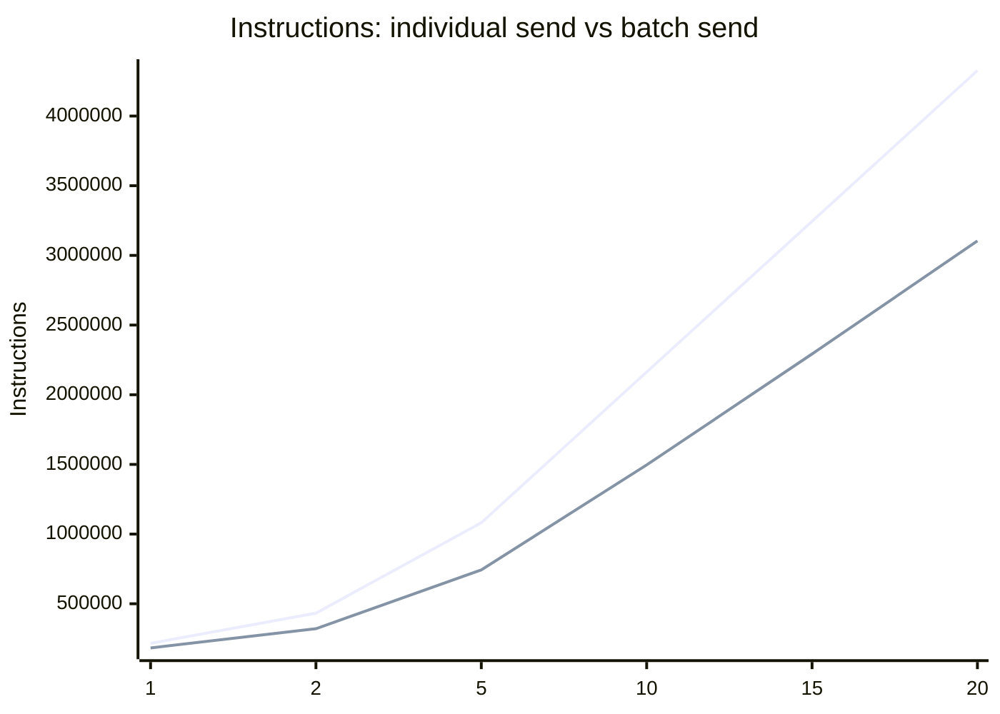

# Wraith Stellar Soroban Resource Budget Report

Measured on 2026-07-28 with `soroban-sdk = 22.0.11` (host `22.1.3`), post
issue #101 sponsored-announcement PR. The reusable harness is in
`stellar/bench/` and can be re-run with:

```sh
cargo run -p wraith-stellar-bench --release
```

Note: bench harness now uses the v2 announcer's `STELLAR_V2_SCHEME_ID` constant
and starts the metadata_len sweep at `1` (the v2 announcer requires a non-empty
view-tag byte), so numbers are directly comparable only to other v2-era runs.

## How to Read the Units

Soroban metering separates execution and ledger access. `instructions` are modeled
CPU instructions, `mem_bytes` are modeled memory bytes, `read_entries` and
`write_entries` count ledger entries touched, `read_bytes` and `write_bytes` are
the serialized ledger bytes read or written, and `event_bytes` is the serialized
contract event payload. Fees are computed from these dimensions using network
configuration, so an optimization can matter even when it only saves ledger bytes
or event bytes. The SDK's `Env::cost_estimate().resources()` reports resources
for the last top-level invocation in the test environment; production simulation
with Soroban RPC should still be used before setting transaction fees.

References:
- https://developers.stellar.org/docs/learn/encyclopedia/network-configuration/resource-and-fee-metering
- https://docs.rs/soroban-sdk/latest/soroban_sdk/struct.Env.html

## Baseline

These baseline numbers were captured before the optimization below.

| Contract | Function | Parameters | Instructions | Mem bytes | Read entries | Write entries | Read bytes | Write bytes | Event bytes |
|---|---|---:|---:|---:|---:|---:|---:|---:|---:|
| stealth-announcer | announce | metadata_len=0 | 15458 | 1666 | 1 | 0 | 104 | 0 | 216 |
| stealth-announcer | announce | metadata_len=32 | 15458 | 1666 | 1 | 0 | 104 | 0 | 248 |
| stealth-announcer | announce | metadata_len=256 | 15458 | 1666 | 1 | 0 | 104 | 0 | 472 |
| stealth-announcer | announce | metadata_len=1024 | 15458 | 1666 | 1 | 0 | 104 | 0 | 1240 |
| stealth-announcer | announce | metadata_len=4096 | 15458 | 1666 | 1 | 0 | 104 | 0 | 4312 |
| stealth-registry | register_keys | first_time | 33345 | 4461 | 1 | 2 | 104 | 332 | 188 |
| stealth-registry | register_keys | replacement | 44880 | 6553 | 1 | 2 | 260 | 332 | 188 |
| stealth-sender | send | asset=xlm | 182403 | 28137 | 5 | 3 | 1068 | 520 | 484 |
| stealth-sender | send | asset=issued | 182355 | 28137 | 5 | 3 | 1068 | 520 | 484 |
| stealth-sender | batch_send | batch_size=1 | 184674 | 28137 | 5 | 3 | 1068 | 520 | 484 |
| stealth-sender | batch_send | batch_size=5 | 807519 | 120229 | 5 | 7 | 1068 | 1416 | 2420 |
| stealth-sender | batch_send | batch_size=10 | 1633634 | 245649 | 5 | 12 | 1068 | 2536 | 4840 |
| stealth-sender | batch_send | batch_size=25 | 4322337 | 690609 | 5 | 27 | 1068 | 5896 | 12100 |
| stealth-sender | sponsored_announce | batch_size=1 | 233608 | 36052 | 7 | 4 | 1164 | 592 | 916 |
| stealth-sender | sponsored_announce | batch_size=5 | 1098506 | 193054 | 11 | 16 | 2060 | 2672 | 2852 |
| stealth-sender | sponsored_announce | batch_size=10 | 2445729 | 491659 | 16 | 31 | 3180 | 5272 | 5272 |
| stealth-sender | sponsored_announce | batch_size=20 | 6018914 | 1430044 | 26 | 61 | 5420 | 10472 | 10112 |
| wraith-names | register | name_len=3 | 59800 | 6269 | 1 | 2 | 104 | 544 | 204 |
| wraith-names | register | name_len=32 | 61413 | 6327 | 1 | 2 | 104 | 572 | 232 |
| wraith-names | resolve | hit | 46120 | 5537 | 1 | 0 | 476 | 0 | 0 |
| wraith-names | resolve | miss | 19766 | 1600 | 1 | 0 | 104 | 0 | 0 |
| wraith-names | name_of | hit | 50728 | 5554 | 1 | 0 | 476 | 0 | 0 |
| wraith-names | name_of | miss | 21581 | 1513 | 1 | 0 | 104 | 0 | 0 |

## Optimization Landed

`wraith-names::name_of()` previously stored `Reverse(meta_hash) -> name_hash`,
then loaded `Name(name_hash)` to return the human-readable name. The reverse map
now stores `Reverse(meta_hash) -> name`, removing the second lookup for reverse
resolution. This does not change public semantics for new deployments: register,
update, release, resolve, and name_of return the same values and enforce the same
ownership checks.

| Case | Instructions Before | Instructions After | Delta | Mem Before | Mem After | Delta | Read Bytes Before | Read Bytes After | Delta |
|---|---:|---:|---:|---:|---:|---:|---:|---:|---:|
| wraith-names name_of hit | 50728 | 47042 | -3686 (-7.3%) | 5554 | 5383 | -171 (-3.1%) | 476 | 452 | -24 (-5.0%) |
| wraith-names register len=3 | 59800 | 59792 | -8 | 6269 | 6240 | -29 | 104 | 104 | 0 |
| wraith-names resolve hit | 46120 | 46096 | -24 | 5537 | 5456 | -81 | 476 | 452 | -24 |

## Current Numbers

These are the post-optimization harness results.

| Contract | Function | Parameters | Instructions | Mem bytes | Read entries | Write entries | Read bytes | Write bytes | Event bytes |
|---|---|---:|---:|---:|---:|---:|---:|---:|---:|
| stealth-announcer | announce | metadata_len=1 | 15096 | 1610 | 1 | 0 | 104 | 0 | 196 |
| stealth-announcer | announce | metadata_len=32 | 15096 | 1610 | 1 | 0 | 104 | 0 | 224 |
| stealth-announcer | announce | metadata_len=256 | 15096 | 1610 | 1 | 0 | 104 | 0 | 448 |
| stealth-announcer | announce | metadata_len=1024 | 15096 | 1610 | 1 | 0 | 104 | 0 | 1216 |
| stealth-announcer | announce | metadata_len=4096 | 15096 | 1610 | 1 | 0 | 104 | 0 | 4288 |
| stealth-registry | register_keys | first_time | 52852 | 7481 | 3 | 2 | 156 | 280 | 372 |
| stealth-registry | register_keys | replacement | 50934 | 6801 | 3 | 2 | 364 | 280 | 372 |
| stealth-sender | send | asset=xlm | 216310 | 31700 | 6 | 3 | 1164 | 520 | 964 |
| stealth-sender | send | asset=issued | 216262 | 31700 | 6 | 3 | 1164 | 520 | 964 |
| stealth-sender | batch_send | batch_size=1 | 225322 | 32365 | 6 | 3 | 1164 | 520 | 1216 |
| stealth-sender | batch_send | batch_size=5 | 846167 | 124433 | 6 | 7 | 1164 | 1416 | 3056 |
| stealth-sender | batch_send | batch_size=10 | 1667725 | 249823 | 6 | 12 | 1164 | 2536 | 5356 |
| stealth-sender | batch_send | batch_size=25 | 4345781 | 694693 | 6 | 27 | 1164 | 5896 | 12256 |
| stealth-sender | sponsored_announce | batch_size=1 | 233980 | 36242 | 7 | 4 | 1164 | 592 | 1096 |
| stealth-sender | sponsored_announce | batch_size=5 | 867569 | 130706 | 7 | 8 | 1164 | 1488 | 2936 |
| stealth-sender | sponsored_announce | batch_size=10 | 1696152 | 259091 | 7 | 13 | 1164 | 2608 | 5236 |
| stealth-sender | sponsored_announce | batch_size=20 | 3462395 | 550211 | 7 | 23 | 1164 | 4848 | 9836 |
| wraith-names | register | name_len=3 | 81415 | 10327 | 2 | 3 | 104 | 568 | 204 |
| wraith-names | register | name_len=32 | 83028 | 10385 | 2 | 3 | 104 | 596 | 232 |
| wraith-names | resolve | hit | 34962 | 3569 | 2 | 0 | 440 | 0 | 0 |
| wraith-names | resolve | miss | 23559 | 2214 | 2 | 0 | 104 | 0 | 0 |
| wraith-names | name_of | hit | 49222 | 4865 | 3 | 0 | 604 | 0 | 0 |
| wraith-names | name_of | miss | 25374 | 2127 | 2 | 0 | 104 | 0 | 0 |

## Batch vs Individual Crossover

`stealth-batch-sender` and `stealth-sender` overlap for multi-recipient pays.
Partners keep asking: at what batch size does the dedicated batch contract become
cheaper than N individual `stealth-sender::send` calls?

Re-run with:

```sh
cargo bench -p wraith-stellar-bench-crossover --bench crossover
# or
cargo run -p wraith-stellar-bench-crossover
```

Chart data is checked into [`stellar/bench/data/`](bench/data/).

### Methodology

- Entry counts: 1, 2, 5, 10, 15, 20
- **Individual**: N isolated `stealth-sender::send` transactions (instructions
  summed; Soroban `resources()` only reports the last top-level invoke)
- **Batch**: one `stealth-batch-sender::batch_send` with N transfers
- Metrics: Soroban instruction count (fee-relevant "gas") and wall-clock ns,
  reported total and per-entry
- Setup (register / init / mint) is excluded from the metered window

### Results

<!-- CROSSOVER_TABLE_START -->
| N | Individual instr | Batch instr | Indiv /entry | Batch /entry | Individual ns | Batch ns | Indiv ns/entry | Batch ns/entry | Winner |
|---:|---:|---:|---:|---:|---:|---:|---:|---:|---|
| 1 | 216310 | 182837 | 216310 | 182837 | 782800 | 575600 | 782800 | 575600 | batch |
| 2 | 432620 | 320986 | 216310 | 160493 | 1002900 | 412000 | 501450 | 206000 | batch |
| 5 | 1081550 | 743151 | 216310 | 148630 | 1992000 | 1003000 | 398400 | 200600 | batch |
| 10 | 2163100 | 1496019 | 216310 | 149601 | 4135300 | 2783400 | 413530 | 278340 | batch |
| 15 | 3244650 | 2292557 | 216310 | 152837 | 7869400 | 6136100 | 524626 | 409073 | batch |
| 20 | 4326200 | 3103832 | 216310 | 155191 | 12951500 | 6341200 | 647575 | 317060 | batch |
<!-- CROSSOVER_TABLE_END -->

### Crossover Point

<!-- CROSSOVER_SUMMARY_START -->
Instruction crossover: `stealth-batch-sender` becomes cheaper at **N = 1**.

Batch stays cheaper across the full measured range. Per-entry batch cost falls
from ~183k instructions at N=1 toward ~149–155k as N grows, while individual
`stealth-sender::send` stays flat at 216,310 instructions per entry (it always
pays for a cross-contract `announce` invoke). Prefer `stealth-batch-sender`
whenever more than zero recipients share a payment.
<!-- CROSSOVER_SUMMARY_END -->

### Chart

<!-- CROSSOVER_CHART_START -->

<!-- CROSSOVER_CHART_END -->

Raw CSV: [`bench/data/crossover.csv`](bench/data/crossover.csv).
Mermaid source: [`bench/data/crossover-chart.md`](bench/data/crossover-chart.md).

## Top Optimization Opportunities

1. Reduce per-recipient `batch_send` overhead. Batch size 25 costs 4,322,337
   instructions and 690,609 memory bytes; the slope is dominated by repeated
   token transfers and cross-contract announcement calls. Expected savings:
   high for every multi-recipient payment.
2. Cap or compress announcement metadata. CPU is flat for `announce`, but event
   bytes scale directly from 216 bytes at empty metadata to 4,312 bytes at 4 KiB.
   Expected savings: high for users who attach large metadata.
3. Avoid the extra reverse lookup in `wraith-names::name_of`. Implemented in
   this PR. Expected savings: medium for reverse lookup-heavy clients.
4. Split name entry storage if resolve dominates. `resolve` loads the whole
   `NameEntry`, including owner and name, to return only the meta-address.
   Expected savings: medium, but it changes storage layout more broadly.
5. Avoid duplicate metadata/key vector traversal in `batch_send`. Current code
   validates lengths once and then does four indexed reads per recipient.
   Expected savings: low to medium; correctness and readability should be
   preserved.

## Sponsored Announcement Cost

The sponsored rows are measured with the bench harness's
`stealth_announcer::STELLAR_V2_SCHEME_ID = 2` and a single authenticated
sender reused across all entries of a bundle (the harness's
`Vec::contains` dedup collapses them). Per-entry cost is the row total
divided by `batch_size`.

| Batch size | Instructions/entry | Mem bytes/entry | Event bytes/entry |
|---:|---:|---:|---:|
| 1 | 233980 | 36242 | 1096 |
| 5 | 173514 | 26141 | 587 |
| 10 | 169615 | 25909 | 524 |
| 20 | 173120 | 27511 | 492 |

Per-entry cost falls rapidly and bottoms out around 169–173k instructions at
`batch_size=10..20`. The `batch_size=1` row carries the full
function-call overhead, so it is not a useful operational measurement: in
production, sponsored announcements are always bundled to amortize the
per-op envelope cost. Operators should target `batch_size >= 5` where the
per-entry envelope drops ~26% vs single-shot.

## Concrete Diff Suggestions

1. Batch send: add a dedicated announcer batch API and invoke it once after all
   transfers. This requires extending `stealth-announcer`, so it is a protocol
   change and was not landed here.
2. Metadata: enforce a product-level metadata size cap, or store only compact
   view-tag payloads in the event. This is semantics-affecting for callers that
   rely on arbitrary metadata and should be decided at the protocol layer.
3. Reverse lookup: store the name string directly in `DataKey::Reverse`. This is
   the optimization implemented here.

