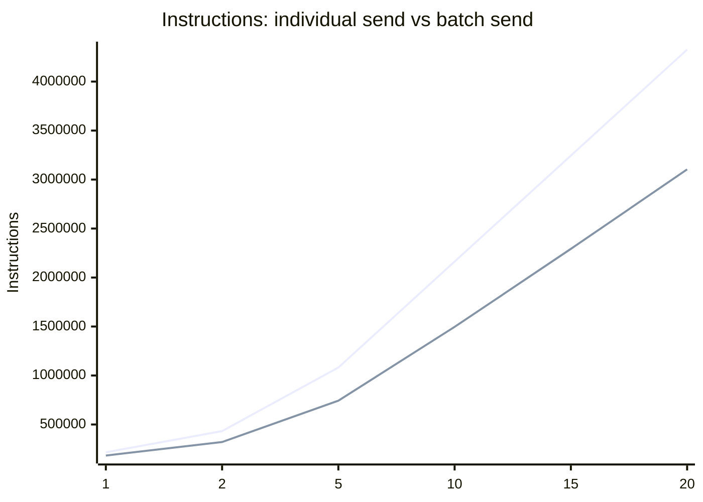

# Crossover chart data

Instruction crossover at N = 1.

```mermaid
xychart-beta
    title "Instructions: individual send vs batch send"
    x-axis [1, 2, 5, 10, 15, 20]
    y-axis "Instructions"
    line "individual (N x send)" [216310, 432620, 1081550, 2163100, 3244650, 4326200]
    line "batch (batch_send)" [182837, 320986, 743151, 1496019, 2292557, 3103832]
```
